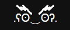
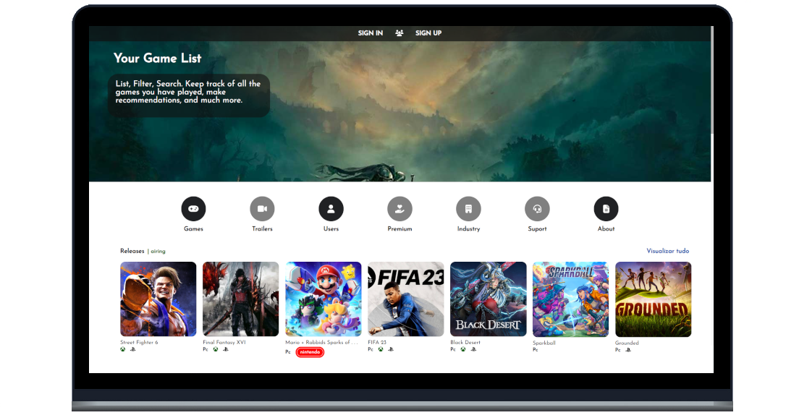

<h1 align="center">
  
</h1>

  <a href="#-tecnologias">Tecnologias</a>&nbsp;&nbsp;&nbsp;|&nbsp;&nbsp;&nbsp;
  <a href="#-projeto">Projeto</a>&nbsp;&nbsp;&nbsp;|&nbsp;&nbsp;&nbsp;
  <a href="#-layout">Layout</a>&nbsp;&nbsp;&nbsp;|&nbsp;&nbsp;&nbsp;
  <a href="#%EF%B8%8F-gerenciamento">Gerenciamento</a>&nbsp;&nbsp;&nbsp;

  <a href="#-como-executar">Como executar</a>&nbsp;&nbsp;&nbsp;|&nbsp;&nbsp;&nbsp;
  <a href="#-licença">Licença</a>

  

 

 

  

## ✨ Tecnologias

Esse projeto foi desenvolvido com as seguintes tecnologias:

- [Git](https://git-scm.com/)
- [Vue](https://vuejs.org/)
- [Jwt](https://jwt.io/)
- [Vite](https://vitejs.dev/)
- [Scss](https://sass-lang.com/)
- [HTML5](https://developer.mozilla.org/pt-BR/docs/Web/HTML)
- [Postgres](https://www.postgresql.org/)
- [Yarn](https://yarnpkg.com/)
- [Vuex](https://vuex.vuejs.org/ptbr/)
- [Axios](https://axios-http.com/ptbr/docs/intro)
- [Django](https://www.djangoproject.com/)
- [Python](https://www.python.org/)
- [TypeScript](https://www.typescriptlang.org/)

## 💻 Projeto

O myJList é um app que faz o gerenciamento dos jogos que você deseja jogar ou daqueles que você 
já está jogando, tornando todo o processo mais organizado para a melhor experiência do usuário.

## 🔖 Layout

Você pode visualizar o layout do projeto através da pasta prototipagem do próprio repositório.

## 🗃️ Gerenciamento

Você pode visualizar o gerenciamento/progresso do projeto através da pasta _Gerenciamento.

## 🚀 Como executar

- <b>Clone o repositório</b>
- <b>PostgreSQL</b> ⇝ Create Database: `CREATE DATABASE my-j-list;`
- <b>Configuracao .Env:</b>
  - Crie um arquivo .env ao lado de manage.py;
  - Insira dentro do arquivo:
    - SECRET_KEY=my-super-secret-key
    - USERNAME=
    - PASSWORD=
- <b>Em Backend Crie a pasta venv: </b> ⇝ Create venv com: `python -m virtualenv venv`
- <b>BackEnd + Linux</b> ⇝ Entre na venv com: `source .venv/bin/activate`
- <b>Adicione as dependencias:</b> 
  - ⇝ sudo apt-get update
  - ⇝ sudo apt-get install build-essential libpq-dev python3-dev
  - ⇝ python -m pip install -r requirements.txt
- <b>Migrations</b> 
  - ⇝ Create Architecture: `python manage.py makemigrations`
  - ⇝ Applying to Database: `python manage.py migrate`
  - ⇝ Feed Database: `python manage.py seeds`
- <b>Start BackEnd</b> ⇝ Inicie com: `python manage.py runserver 0.0.0.0:8000`
- <b>FrontEnd</b> ⇝ Instale as dependências com: `yarn install`
- <b>FrontEnd</b> ⇝ Inicie o servidor com: `yarn run dev`

Agora você pode acessar [`localhost:5173`](http://localhost:5173) do seu navegador.

## 📄 Licença

Esse projeto está sob a licença MIT. Veja o arquivo [LICENSE](LICENSE.md) para mais detalhes.

---

Feito com ♥ by WellingtonPLF 👋🏻 [Contact Me 😊](https://mail.google.com/mail/?view=cm&fs=1&to=wellplf@gmail.com)